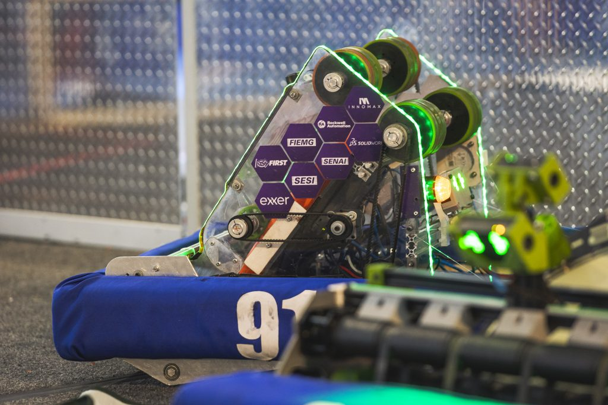

# This is example 1

With this line you can insert images:

Or videos with this one:

  <iframe
    style={{ position: 'absolute', top: 0, left: 0, width: '100%', height: '100%' }}
    src="https://youtube.com/embed/9VpVZiApRFw"
    title="YouTube video player"
    frameBorder="0"
    allow="accelerometer; autoplay; clipboard-write; encrypted-media; gyroscope; picture-in-picture; web-share"
    referrerPolicy="strict-origin-when-cross-origin"
    allowFullScreen
  ></iframe>

